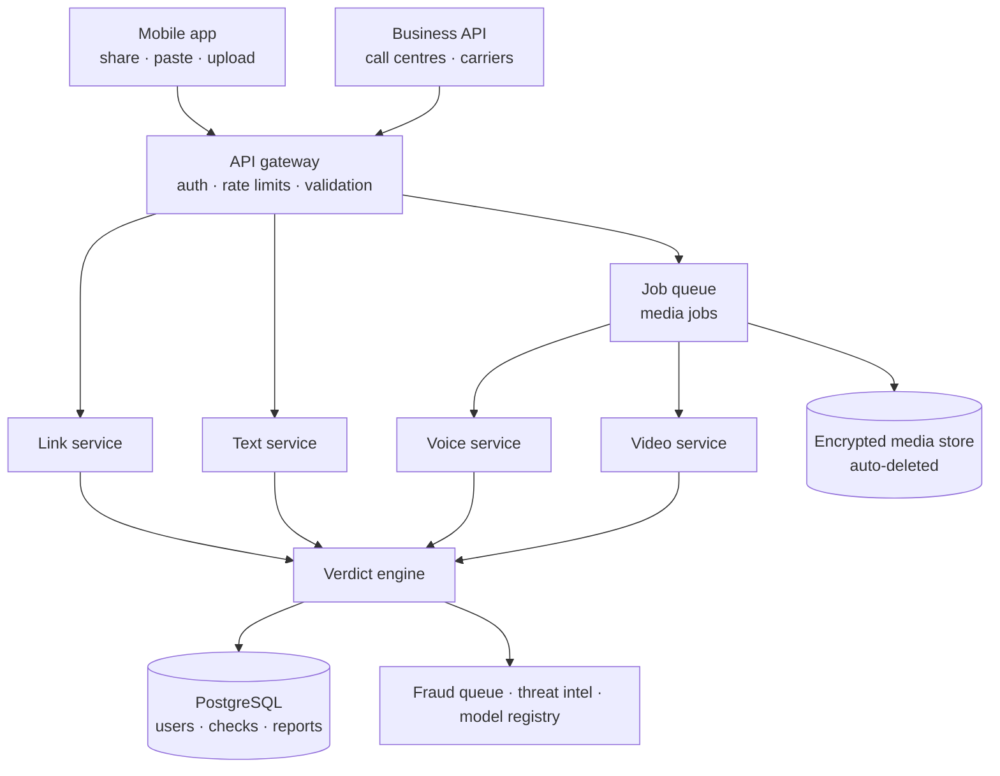

# Ntiyiso

> **Stop the scam before the click.**

Ntiyiso ("truth" in Xitsonga) is an AI-powered mobile app that tells people, in seconds, whether a **link, message, voice note or video** is genuine or fake. It is built for ordinary and elderly users, and designed to keep pace with AI-driven fraud.

**Status:** Hackathon prototype / pre-pilot. See [What works today](#what-works-today) for an honest view of what is built versus planned.

---

## Table of contents

1. [The problem](#the-problem)
2. [The solution](#the-solution)
3. [How it works](#how-it-works)
4. [Architecture](#architecture)
5. [Tech stack](#tech-stack)
6. [Repository structure](#repository-structure)
7. [Getting started](#getting-started)
8. [What works today](#what-works-today)
9. [Roadmap](#roadmap)
10. [Security and privacy](#security-and-privacy)
11. [Limitations](#limitations)
12. [Business model](#business-model)
13. [Documentation](#documentation)
14. [Sources](#sources)
15. [Team and licence](#team-and-licence)

---

## The problem

Scammers can now clone a voice from a few seconds of audio, put a real face on a fake video, and send convincing messages to thousands of people at once. They rely on one thing above all: **panic**. The victim has seconds to decide, and the scammer is counting on a click, a reply or a payment before the victim thinks.

Picture an elderly relative (*mkhulu*) who receives a message saying an account is blocked or a prize is waiting, with a link. There is no easy way to tell if it is real, and nobody beside them to ask.

| Figure | Source |
|---|---|
| **R2.4bn** lost to digital banking crime in South Africa in 2025, across 110,000+ incidents, mostly social engineering | SABRIC Annual Crime Statistics 2025 [5] |
| **22%** of Africa's deepfake fraud cases are in South Africa, the highest share on the continent | Smile ID 2026 Digital Identity Fraud Report [2] |
| **+269%** rise in deepfake incidents in South Africa | Sumsub Identity Fraud Report 2025-26 [3] |
| **8.72bn** spam calls received by South Africans in Q1 2026 | COMRiC Telecommunications Sector Report 2026 [1] |

> These figures come from industry bodies and verification vendors who measure different things (cases, attempts, losses). Use them to show scale and direction, and always quote the source. Growth percentages are year-on-year changes as reported by those sources.

## The solution

A customer shares or pastes a suspicious item into Ntiyiso. The analysis runs **on our servers, never on the customer's phone**, and returns a simple verdict with plain-language reasons:

- 🔴 **HIGH RISK**: do not click, do not reply
- 🟠 **SUSPICIOUS**: do not act; check directly with your provider
- 🟢 **LOOKS GENUINE**

Ntiyiso has three layers:

| Layer | Audience | What it does |
|---|---|---|
| **Customer app** (our focus) | Everyday people, including elderly and non-technical users | Check a link, message, voice note or video and get a verdict in seconds |
| **Business API** | Banks, money-transfer firms, call centres, carriers | Screen calls and media in real time, flag fakes, feed a fraud dashboard |
| **Shared intelligence** | Both | Reported scams improve detection for everyone; patterns feed bank fraud teams |

Ntiyiso can run as a standalone app or as a **feature inside a partner's banking or money-transfer app**, so checking takes two taps from the moment a scam arrives.

## How it works

1. **Something suspicious arrives** (WhatsApp, SMS, email, social media).
2. **Share or paste it into Ntiyiso.** Long-press, tap Share, choose Ntiyiso. Or paste a link, or upload a voice note or video. No SMS-reading permission is needed.
3. **Analysis runs in seconds.** Link, text, voice and video services run in parallel on the server.
4. **A plain verdict with 2-3 reasons** (for example: lookalike domain, prize claim, asks for PIN).
5. **Act:** report it, warn the family circle, or delete.

### What the app checks

| Feature | What it looks for |
|---|---|
| **Link checker** | Real destination after shorteners, match against official domains, lookalikes (e.g. `fnb.com.secure-login.xyz`, swapped letters), reputation (Google Safe Browsing), domain age, certificate details |
| **Message analyser** | Urgency, prizes, blocked-account threats, requests for PIN/OTP, bank or money-transfer impersonation, pressure phrases |
| **Voice-note checker** | Signs that a voice is synthetic or cloned, using audio models trained on real and fake speech |
| **Video checker** | Face-swap and AI-generated artefacts, lip-sync mismatch, frame-to-frame inconsistencies |
| **Report and warn** | One-tap report to a fraud queue; ready-made warning for family and friends |
| **Family circle** (optional) | A trusted relative is alerted when a high-risk item is checked |

### Designed for people like mkhulu

- Large text and buttons; colour is always paired with an icon and words
- Maximum **two taps** from receiving a scam to seeing a verdict
- Local languages (isiZulu, Sesotho, Xitsonga, Afrikaans and more over time)
- Voice read-out of the verdict
- Calm wording; Ntiyiso never blames the user

### The key metric: time to verdict

Scammers win when the victim's urge to click is faster than the check. Our success metric is **seconds from receiving a suspicious item to getting a verdict**. We will measure it in the prototype.

## Architecture



**No single signal decides.** The verdict engine fuses link, text, voice and video scores plus context (for example, a "bank" message that links to a domain registered last week). When confidence is low, the app says *"Suspicious, do not act. Check directly with your provider"* rather than guessing.

## Tech stack

| Layer | Choice |
|---|---|
| Mobile app | React Native (or Flutter) with native share-target modules for Android and iOS |
| API | Python (FastAPI) or Node.js behind an API gateway |
| Async jobs | Redis or RabbitMQ with Celery-style workers |
| Link intelligence | Sandboxed fetcher, allowlist, lookalike algorithms, Google Safe Browsing, RDAP/WHOIS, TLS inspection |
| ML models | PyTorch / ONNX; audio spoof detection (AASIST or RawNet2-style, trained on ASVspoof data); video forensics |
| Data | PostgreSQL; encrypted S3-compatible storage with automatic deletion |
| Infrastructure | Docker, then Kubernetes with autoscaling and a GPU pool |
| Observability | Logging, metrics, drift and accuracy dashboards, model registry |

> This is a recommended starting stack. Adjust it to what the team knows best; the architecture stays the same.

## Repository structure

*Suggested layout. Adjust to match what you actually commit.*

```
ntiyiso/
├── README.md
├── docs/
│   ├── BACKEND.md
│   └── FRONTEND.md
├── backend/            # FastAPI app, analysis services, verdict engine
├── mobile/             # React Native app
├── ml/                 # Model training, evaluation, benchmarks
├── infra/              # Docker, Kubernetes, CI/CD
└── .env.example
```

## Getting started

> Commands below assume the recommended stack (FastAPI + React Native). Update paths and commands to match the repo.

### Prerequisites

- Python 3.11+
- Node.js 20+
- Docker and Docker Compose
- A Google Safe Browsing API key
- Android Studio and/or Xcode for the mobile app

### Run the backend

```bash
cd backend
cp .env.example .env            # add your API keys
docker compose up -d redis postgres
pip install -r requirements.txt
uvicorn app.main:app --reload
```

The API is then available at `http://localhost:8000` (interactive docs at `/docs`).

### Run the mobile app

```bash
cd mobile
npm install
npx react-native run-android    # or: run-ios
```

Point the app at your backend by setting `API_BASE_URL` in the mobile `.env`.

See [`docs/BACKEND.md`](docs/BACKEND.md) and [`docs/FRONTEND.md`](docs/FRONTEND.md) for full setup and design details.

## What works today

> **TEAM TO COMPLETE before submission.** Judges respect honesty: state clearly what runs in the demo and what is planned.

| Capability | Status |
|---|---|
| Link check endpoint (allowlist, lookalike, Safe Browsing) | ☐ Built / ☐ Planned |
| Text check endpoint (scam-language rules) | ☐ Built / ☐ Planned |
| Verdict engine | ☐ Built / ☐ Planned |
| Mobile share target + paste screen + verdict screen | ☐ Built / ☐ Planned |
| Voice detection with a pretrained model | ☐ Built / ☐ Planned |
| Video detection | ☐ Planned |
| Family circle | ☐ Planned |
| Business dashboard | ☐ Planned |

## Roadmap

| Phase | What gets built |
|---|---|
| **1. Prototype** | Backend first: link and text endpoints, verdict engine. Then the mobile app: share target, paste screen, loading, verdict screen, history, report |
| **2. Voice** | Voice-note upload, async job queue, pretrained synthetic-voice model, results screen, benchmarks on local voices |
| **3. Video and family** | Video checks, family circle alerts, more languages, business dashboard on the same API |
| **4. Launch readiness** | Security testing, POPIA review, pilot partner integration, monitoring and model-update pipeline |

## Security and privacy

An anti-fraud app has to be the most trustworthy app on the phone.

- **Suspicious links are never opened on the phone.** Only a sandboxed server fetches them, with timeouts, hop limits and SSRF protection.
- **Suspicious links are never tappable.** Results show the domain as plain text.
- **No SMS-reading permission.** The customer chooses what to share.
- **Encrypted in transit and at rest.** Uploaded media is deleted automatically after analysis; only the verdict and non-identifying fingerprints are kept.
- **POPIA compliance:** minimum data, clear explanations, consent for optional features, support for deletion requests.
- **Abuse protection:** rate limits, authentication and probing detection so attackers cannot test fakes against the detector.
- **Independent security testing** (penetration tests, code review) before launch, plus a vulnerability-reporting process.

## Limitations

Ntiyiso is a **risk-scoring tool, not a guarantee**. It reduces risk and speeds up the decision; it does not replace verifying through an official channel for high-value actions.

- Detection is imperfect and AI keeps improving. We use an ensemble of signals and a continuous improvement loop (monitor new generators → red-team → retrain and benchmark → shadow-test and release → learn from reports).
- Phones do not allow apps to screen live calls or read SMS freely. The customer app uses share, paste and upload; live call screening is delivered through the business API.
- The prototype uses published research baselines. **We will publish benchmark results on a held-out test set before quoting any accuracy numbers.**
- False alarms are possible; the app shows reasons and offers a way to appeal.

## Business model

Customers are protected for free through their provider, and the provider pays. This avoids charging the people most at risk and gives distribution through existing user bases.

| Payer | Model |
|---|---|
| Banks and money-transfer firms | Per-active-user licence or per check, plus onboarding |
| Call centres and BPOs | Per call screened or per attack blocked, with volume tiers |
| Mobile networks and carriers | Platform licence; per-message or per-call pricing at scale |
| Consumers (later) | Free basic checks; optional premium (family circle, unlimited media checks) |

Specific rand figures will be set with pilot partners once real volumes are known.

## Documentation

| Document | Contents |
|---|---|
| [`docs/BACKEND.md`](docs/BACKEND.md) | Services, verdict engine, API reference, data model, security, deployment |
| [`docs/FRONTEND.md`](docs/FRONTEND.md) | Screens, share-target setup, state, accessibility, i18n, testing |
| Product brief (`Ntiyiso_Product_Brief.pdf`) | Problem, solution, business, scalability, judge Q&A |

## Sources

1. COMRiC Telecommunications Sector Report 2026, via Connecting Africa
2. Smile ID 2026 Digital Identity Fraud Report, via WeeTracker (19 March 2026)
3. Sumsub Identity Fraud Report 2025-26, via BusinessDay
4. TransUnion Africa on deepfakes, via Sumsub / Biometric Update (2 Oct 2025)
5. SABRIC Annual Crime Statistics 2025, via BusinessTech
6. News24: Fake Ramaphosa video orders Penny Ntuli's arrest, but it is AI (30 September 2025)
7. Africa Check via AllAfrica: AI-generated video of the President and Penny Ntuli
8. ITWeb: African economies face uneven fortunes in combating fraud
9. Canadian Press fact check: AI detection tools are not 100% accurate
10. Sumsub Identity Fraud Report 2025-26 coverage (People's Post)

Full clickable links are in the product brief.

## Team and licence

- **Team:** _add names and roles_
- **Contact:** _add email_
- **Licence:** _choose a licence (e.g. MIT, Apache-2.0) or mark as proprietary_