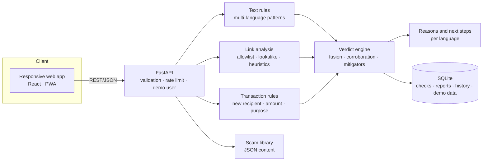

# Ntiyiso Scam Shield

> **Stop the scam before the click, and before the payment.**

Ntiyiso ("truth" in Xitsonga and Vhenda) is an AI-assisted scam checker for people who send and receive money. A customer pastes a suspicious message or link, or describes a payment they are about to make, and gets a plain verdict in seconds: **what looks risky, why, and what to do next.**

Built for **WeThinkCode_ SheHacks, Challenge C: Scam Shield** (Mukuru customer problem). It is a responsive web app on top of a separate API, designed to work on a cheap phone and a weak signal.

**Status:** Hackathon prototype. See [What works today](#what-works-today) for an honest view of what is built versus planned. All Mukuru account and transaction data in the demo is **simulated**; no Mukuru systems are accessed.

---

## Table of contents

1. [The problem](#the-problem)
2. [The solution](#the-solution)
3. [How it works](#how-it-works)
4. [Designed to be heeded, not ignored](#designed-to-be-heeded-not-ignored)
5. [Architecture](#architecture)
6. [Tech stack](#tech-stack)
7. [Repository structure](#repository-structure)
8. [Getting started](#getting-started)
9. [What works today](#what-works-today)
10. [Demo script](#demo-script)
11. [How this maps to the brief and judging criteria](#how-this-maps-to-the-brief-and-judging-criteria)
12. [Key design decisions](#key-design-decisions)
13. [Roadmap](#roadmap)
14. [Security and privacy](#security-and-privacy)
15. [Limitations](#limitations)
16. [Business model](#business-model)
17. [Documentation](#documentation)
18. [Sources](#sources)
19. [Team and licence](#team-and-licence)

---

## The problem

**Meet Blessing.** She has just arrived in a new city and is looking for work. Scammers know it. Fake job offers, "verify your account" phishing and romance scams all land in her inbox, and they all rely on one thing: **panic and trust, at the wrong moment.** One misplaced payment can cost her a month's wages, money that was meant to be sent home.

The same tactics are now supercharged by AI: cloned voices, convincing fake messages sent to thousands of people at once. And Blessing is not alone. An elderly relative at home (*mkhulu*) faces the same messages with even less support. Neither has anyone beside them to ask.

| Figure | Source |
|---|---|
| **R2.4bn** lost to digital banking crime in South Africa in 2025, across 110,000+ incidents, mostly social engineering | SABRIC Annual Crime Statistics 2025 [5] |
| **22%** of Africa's deepfake fraud cases are in South Africa, the highest share on the continent | Smile ID 2026 Digital Identity Fraud Report [2] |
| **+269%** rise in deepfake incidents in South Africa | Sumsub Identity Fraud Report 2025-26 [3] |
| **8.72bn** spam calls received by South Africans in Q1 2026 | COMRiC Telecommunications Sector Report 2026 [1] |

> These figures come from industry bodies and verification vendors who measure different things (cases, attempts, losses). Use them to show scale and direction, and always quote the source. Growth percentages are year-on-year changes as reported by those sources.

## The solution

Ntiyiso has three checks, all behind one verdict engine:

| Check | The customer does | Ntiyiso returns |
|---|---|---|
| **Check a message or link** | Pastes (or shares) a suspicious message or URL | Verdict, risk score, the red-flag phrases highlighted, plain reasons, next steps |
| **Check before you send** | Enters who they are paying, how much, and why, *before* confirming | Verdict on the payment: new recipient, unusual amount, risky reason, plus a calm "pause" step if needed |
| **Learn the scams** | Opens the library | Short guides to the common tricks (fake job fees, "verify your account", romance scams) with examples and what to do |

Every result is one of three verdicts:

- 🔴 **HIGH RISK**: do not click, do not reply, do not pay
- 🟠 **SUSPICIOUS**: do not act yet; check directly with the company or person
- 🟢 **LOOKS GENUINE**: no warning signs found (never a guarantee)

Users can also **report** a scam to a fraud queue, **warn a friend** with a ready-made message, and tap **"This looks wrong"** if we got it wrong.

## How it works

1. **Something suspicious arrives** (WhatsApp, SMS, email, social media), or the customer is about to send money.
2. **Paste it in, or describe the payment.** On Android, an installed web app can also be a share target (stretch goal). No SMS-reading permission is ever needed.
3. **Analysis runs on the server in about a second.** Message, link and payment rules run together and are fused into one verdict.
4. **A plain verdict with 2-3 reasons and one clear next step.** Red-flag phrases are highlighted in the message so the user can see *why*.
5. **Act:** report, warn a friend, learn more, or pause the payment.

### What the app checks

| Feature | What it looks for |
|---|---|
| **Message analyser** | Requests for PIN/OTP/password, upfront fees for a job or prize, "account blocked" threats, urgency, too-good-to-be-true job offers, pressure to move to a private chat, money requests from someone met online, untraceable payment methods, secrecy requests, impersonation of Mukuru, banks or government |
| **Link checker** | Match against official domains, lookalikes and subdomain tricks (e.g. `fnb.com.secure-login.xyz`), IP-address links, suspicious domain endings, shorteners that hide the destination. Stretch: redirect resolution, domain age, Google Safe Browsing |
| **Payment checker** | First-time recipient, amount far above the customer's usual, a *stated reason* that is a known scam pattern (paying a "fee" for a job, visa or prize; sending to someone never met), a send straight after checking a high-risk message, bursts of sends to new recipients |
| **Scam library** | Known tricks with red flags, a worked example, and what to do |

> **Not in the prototype:** voice-note and video deepfake detection. They are part of the longer vision (see [Roadmap](#roadmap)) but are deliberately out of scope for a 1.5 day build.

## Designed to be heeded, not ignored

The hard part of Scam Shield is catching real threats **without crying wolf**. Too many false alarms and people stop listening. Our approach:

- **Corroboration, not single signals.** One weak signal (a new recipient, a bit of urgency) never produces a red warning. Red needs a *critical* signal (e.g. asks for your PIN, demands a fee for a job) or evidence from more than one category.
- **Mitigators.** A message whose links are all on the official-domain allowlist, with no credential or fee request, is capped at low risk. A genuine "never share your PIN" notice is *not* flagged for mentioning a PIN.
- **Graded warnings.** Amber is a gentle "check first", not an alarm. Red is reserved for strong evidence.
- **Always explain.** Every verdict shows the top 2-3 reasons in plain language and highlights the exact phrases in the message.
- **Always say what to do next.** One action, not a lecture.
- **Calm tone.** Ntiyiso never blames the user.
- **Measure it.** A labelled fixture set of scam *and* legitimate messages (including tricky legitimate ones) is run on every change, and we track false positives separately from missed scams.
- **A way to push back.** "This looks wrong" feeds our false-positive count.

Details are in [`docs/BACKEND.md`](docs/BACKEND.md#6-verdict-engine) and [`docs/FRONTEND.md`](docs/FRONTEND.md#5-verdict-screen-specification).

### Designed for people under pressure

- Large text and buttons; colour is always paired with an icon and words
- One main action per screen; a verdict in as few taps as possible
- English plus at least one local language pack (see [Limitations](#limitations)); voice read-out where the browser supports it
- Small, fast pages for cheap phones; the scam library works offline

### The key metric: time to verdict

Scammers win when the urge to click or pay is faster than the check. Our success metric is **seconds from opening the app to seeing a verdict**, measured in the prototype without capturing message content.

## Architecture



Frontend and backend are separate deployables that talk only through a documented REST API (OpenAPI generated by FastAPI). The full production vision (queues, GPU workers, voice and video services) is described in [`docs/BACKEND.md`](docs/BACKEND.md#18-beyond-the-prototype).

> **What is built today.** The shipped prototype is the front end only: a static
> site with no framework and no dependencies, carrying both the customer app and
> the fraud-desk console. The verdict engine, translations and scam content are
> real and run in the browser; the FastAPI service in the diagram above is the
> target architecture, and the client falls back to its local engine when the
> API is not there. The rest of this document describes the intended design, so
> read "Repository structure" above for what is actually on disk.

## Tech stack

| Layer | Choice | Why |
|---|---|---|
| Web app | React + TypeScript + Vite, installable as a PWA | Works on a phone browser; no app-store step; small bundle |
| Styling | CSS variables / design tokens, mobile-first | Easy to align with Mukuru's look and feel; light and dark |
| API | Python 3.11, FastAPI, Pydantic | Fast to build, typed schemas, auto-generated OpenAPI docs |
| Detection | Rules engine with weighted signals (noisy-OR fusion). Stretch: small scikit-learn text classifier | Explainable, deterministic, fast, works offline |
| Data | SQLite (SQLAlchemy), JSON files for patterns, allowlist and scam library | Zero setup; swap for PostgreSQL later |
| Explanations | Deterministic reason templates per language. Stretch: optional LLM to simplify wording (never decides the verdict) | Demo works without any external service |
| Tests | pytest (backend), Vitest + Testing Library (frontend), fixture set of scam and legitimate messages | Measures false positives, not just catches |
| Dev and deploy | Docker Compose for local; any simple host for the demo | |

> This is the chosen starting stack. If the team swaps a piece, the API contract in [`docs/BACKEND.md`](docs/BACKEND.md#7-api-reference) is what must stay stable.

## Repository structure

The site is plain static HTML, CSS and JavaScript — no framework, no build
step, no dependencies. Every URL is a real document with a clean, extensionless
path, and each feature owns a folder holding exactly three files.

```
ntiyiso/
├── index.html               # front door only: sends you to the app or to sign-in
├── 404.html                 # styled not-found page
├── app/                     # the nine customer screens
│   ├── check/  send/  library/  alerts/
│   ├── checking/  verdict/      # the check flow, split across two documents
│   └── history/  settings/  scam/
├── auth/                    # login/ and signup/
├── desk/                    # the six fraud-desk screens
│   ├── login/
│   └── overview/  live/  radar/  business/  case/
├── shared/
│   ├── css/                 # base, customer, auth, desk
│   └── js/                  # customer.js and desk.js
├── assets/logo.png
├── serve/server.mjs         # dev server that understands clean URLs
├── tools/                   # the generators and the checks (see below)
├── build/monolith.html      # the original single-file build; the source of truth
├── netlify.toml  vercel.json  _redirects  .htaccess    # clean-URL rewrites
└── backend/routes/whatsapp.py
```

Each folder under `app/`, `auth/` and `desk/` contains `index.html`,
`styles.css` and `script.js`, and nothing else. The two shared libraries hold
everything more than one screen needs, so a screen's own files stay small enough
to read in one go.

### Where the code comes from

`build/monolith.html` is the original 6,174-line merged build, kept unmodified as
the single source of truth. The `tools/` scripts slice it and emit everything
else, so the split never retypes markup or logic:

| Script | Does |
|---|---|
| `extract.py` | slices the monolith into CSS, JS and markup blocks under `build/extracted/` |
| `split_css.py` | writes the shared palettes and the per-feature `styles.css` |
| `build_customer_js.py` | writes `shared/js/customer.js` |
| `build_desk_js.py` | writes `shared/js/desk.js` |
| `build_pages.py` | writes all 18 page documents and their `script.js` files |

Generated files carry a banner saying so. **Edit the tools, not the output** —
`python tools/check_all.py --rebuild` regenerates and re-verifies everything.

## Getting started

### Prerequisites

- Node.js 20+ (to run the dev server and the browser checks)
- Python 3.11+ (only to run the generators and checks)
- No dependencies to install, and no API keys.

### Run the site

```bash
node serve/server.mjs          # http://localhost:5173
node serve/server.mjs --port 8080
```

The root is a front door: it sends you to `/app/check` if this device has a
session, and to `/auth/login` if it does not.

### Run the checks

```bash
python tools/check_all.py              # check what is on disk
python tools/check_all.py --rebuild    # regenerate from the monolith first
```

This runs, in order: every `.js` file parses; the markup slices are cut where
the builder expects; each page has unique ids, balanced tags and the right
current tab; every route and asset resolves over HTTP; every page runs in a
real browser without a JavaScript error; and the flows that cross documents —
sign-up, running a check, walking the desk rail — still work.

The last two drive headless Chrome over the DevTools protocol, so they need
Chrome or Edge on the machine and nothing installed.

Individual checks, if you want just one:

```bash
python tools/check_markup.py     # slice boundaries
python tools/check_pages.py      # page structure
python tools/smoke.py http://localhost:5199
node  tools/browser_check.mjs http://localhost:5199
node  tools/flow_check.mjs   http://localhost:5199
node  tools/diag_errors.mjs  http://localhost:5199 /app/check customer
```

`diag_errors.mjs` takes a route and a seed (`none`, `customer`, `staff`) and
prints the full stack of anything that throws, which is the quickest way to
debug a page that comes up blank.

### Deploying

The site is static, so any host works. Clean URLs are handled by the rewrite
rules already committed for each of the common ones: `netlify.toml`, `_redirects`
(Netlify), `vercel.json` and `.htaccess` (Apache). Point the publish directory
at the repository root. The dev server exists only to make those same rules
work locally.

## What works today

> **TEAM TO COMPLETE before submission.** Judges respect honesty: state clearly what runs in the demo and what is planned.

| Capability | Status |
|---|---|
| Message check endpoint (scam-language rules, English) | ☐ Built / ☐ Planned |
| Link analysis (allowlist, lookalike, heuristics) | ☐ Built / ☐ Planned |
| Payment check endpoint (new recipient, unusual amount, risky purpose) | ☐ Built / ☐ Planned |
| Verdict engine (fusion, corroboration rule, mitigators) | ☐ Built / ☐ Planned |
| Web app: paste, checking, verdict screen with highlights | ☐ Built / ☐ Planned |
| Web app: check-before-you-send flow | ☐ Built / ☐ Planned |
| Scam library (list and detail) | ☐ Built / ☐ Planned |
| History, report, "This looks wrong" | ☐ Built / ☐ Planned |
| Second language pack (suggested: isiZulu or Shona) | ☐ Built / ☐ Planned |
| Fixture evaluation script with false-positive count | ☐ Built / ☐ Planned |
| Voice read-out of the verdict | ☐ Built / ☐ Planned |
| PWA install, offline library, Android share target | ☐ Built / ☐ Planned |
| Small ML classifier (stretch) | ☐ Built / ☐ Planned |
| Redirect resolution, Safe Browsing, domain age (stretch) | ☐ Built / ☐ Planned |
| Voice-note and video deepfake detection | ☐ Planned (post-hackathon) |
| Family circle and business dashboard | ☐ Planned (post-hackathon) |

## Demo script

A suggested 5-7 minute flow. Keep it end-to-end and rehearse it.

1. **The customer (30s).** Meet Blessing. One bad click or payment costs a month's wages.
2. **Fake job offer (60s).** Paste a "job offer, pay a registration fee" message. Show HIGH RISK, the highlighted phrases, the reasons and the next step.
3. **A genuine message (45s).** Paste a real-looking transaction confirmation that says "never share your PIN". Show LOOKS GENUINE. *This is the "no crying wolf" moment.*
4. **Phishing link (45s).** Paste a "verify your account" message with a lookalike link. Show the domain as plain text, never tappable.
5. **Check before you send (90s).** New recipient, large amount, reason "fee for a job". Show the pause step. Then change the reason to "family" and show how the verdict softens.
6. **Learn the scams (30s).** Open a library entry; tap its example straight into the checker.
7. **Language and accessibility (30s).** Switch language, use Listen.
8. **How it works and what we learned (60s).** Show the "why this verdict" panel, the fixture results, and the design decisions below.

## How this maps to the brief and judging criteria

| Brief item | Where it lives |
|---|---|
| Detect suspicious messages or transactions | `/check/message`, `/check/link`, `/check/transaction` |
| Show a clear warning and explain why | Verdict screen: banner, reasons, highlighted phrases |
| Tell the user what to do next | `instruction` and `next_steps` on every result |
| Rules-based or simple classifier | Weighted rules engine; optional small classifier |
| Bonus: paste-a-message checker | Home screen, primary flow |
| Bonus: risk score with plain-language reason | Risk meter plus `reason_text` |
| Bonus: learn-the-scams library | Library screens and `/scams` |
| Bonus: unusual transactions | Check-before-you-send flow |
| Bonus: more than one language | i18n packs for UI and reasons |
| Deliverables: prototype, API, responsive frontend, demo | This repository and the demo script |

| Judging criterion | What we are showing |
|---|---|
| **Functionality (40%)** | Message, link and payment checks end to end, history, report, library |
| **Creativity and UX (25%)** | Highlighted red-flag phrases, graded warnings, "pause" step, learn-from-example, voice read-out |
| **Technical implementation (25%)** | Separate API and web app, typed contract, explainable engine, fixture-based evaluation |
| **Presentation and teamwork (10%)** | Rehearsed demo; clear split of work (see the plan in [`docs/BACKEND.md`](docs/BACKEND.md#17-build-plan)) |

## Key design decisions

Be ready to explain these to the judges.

| Decision | Reason |
|---|---|
| **Responsive web app (PWA), not a native app** | The brief asks for a web app that works on a phone; no install friction; one codebase |
| **Rules first, ML optional** | Explainable, testable in a day, no training data needed; the brief accepts rules-based |
| **Noisy-OR fusion of weighted signals** | Simple to explain: independent warning signs add up, but no single weak sign is enough |
| **Corroboration rule and mitigators** | Directly attacks the false-alarm problem |
| **Check the payment as well as the message** | The money moment is where the loss happens; the stated reason is the strongest signal we can get |
| **Server-side analysis only** | Suspicious links are never opened or rendered on the phone |
| **Fixtures include legitimate messages** | We report false positives, not just catches |
| **Simulated Mukuru data** | We have no access to real accounts, and should not pretend to |

## Roadmap

| Phase | What gets built |
|---|---|
| **1. Hackathon prototype** | Message, link and payment checks; verdict engine; web app with verdict, library, history, report; one extra language; fixture evaluation |
| **2. Hardening** | Redirect resolution and reputation lookups, small classifier, more languages, native-speaker review of all scam wording, appeal review queue |
| **3. Media** | Voice-note and video checks with a job queue and pretrained detectors; benchmarks on local voices |
| **4. Partners and scale** | Embeddable module inside a partner app, business API and dashboard, family circle, call-screening API, POPIA review, security testing |

## Security and privacy

An anti-fraud app has to be the most trustworthy app on the phone.

- **Suspicious links are never opened on the device.** Analysis is server-side. Link resolution, if enabled, runs in a guarded fetcher with timeouts, hop limits and SSRF protection.
- **Suspicious links are never tappable.** Results show the domain as plain text, with no anchor element.
- **No SMS-reading permission.** The customer chooses what to share. The clipboard is only read when the customer taps **Paste**.
- **Minimum data.** The server stores a hash of each input, the verdict and reasons. The prototype also stores a short, masked excerpt so the customer's own history is readable; this can be switched off.
- **Encrypted in transit.** TLS only outside local development.
- **No content in logs or analytics.**
- **POPIA mindset:** clear explanations, consent for optional features, deletion of a user's data on request.
- **Abuse protection:** rate limits and input limits so the detector cannot be probed freely.
- **Before any real launch:** independent penetration test, code review, and a vulnerability-reporting process.

## Limitations

Ntiyiso is a **risk-scoring tool, not a guarantee**. It reduces risk and speeds up the decision; it does not replace verifying through an official channel before a high-value payment.

- Detection is imperfect and scammers adapt. The prototype uses transparent rules and a small test set; **we will not quote accuracy figures** beyond what we measured on a held-out set, and we will say how small it is.
- Our fixture messages are written or collected by the team and are **not representative of all scams**.
- Phones do not let web apps read SMS or screen live calls. The customer app relies on paste, share and manual entry.
- Payment checks use **simulated** history and recipients. A real deployment would need a partner integration.
- Local-language wording must be reviewed by native speakers before real use. Language packs in the prototype are limited.
- False alarms are possible; the app shows reasons and offers "This looks wrong".

## Business model

Customers are protected for free through their provider, and the provider pays. This avoids charging the people most at risk and gives distribution through existing user bases.

| Payer | Model |
|---|---|
| Money-transfer firms and banks | Per-active-user licence or per check, plus onboarding |
| Call centres and BPOs | Per call screened or per attack blocked, with volume tiers |
| Mobile networks and carriers | Platform licence; per-message or per-call pricing at scale |
| Consumers (later) | Free basic checks; optional premium features |

Specific rand figures will be set with pilot partners once real volumes are known.

## Documentation

| Document | Contents |
|---|---|
| [`docs/BACKEND.md`](docs/BACKEND.md) | Engine, signals and weights, verdict logic, API reference, data model, testing, build plan |
| [`docs/FRONTEND.md`](docs/FRONTEND.md) | Screens, verdict and warning UX, state, accessibility, i18n, PWA, testing |
| Product brief (`Ntiyiso_Product_Brief.pdf`) | Problem, solution, business, scalability, judge Q&A. **Update to match this README** |

## Sources

1. COMRiC Telecommunications Sector Report 2026, via Connecting Africa
2. Smile ID 2026 Digital Identity Fraud Report, via WeeTracker (19 March 2026)
3. Sumsub Identity Fraud Report 2025-26, via BusinessDay
4. TransUnion Africa on deepfakes, via Sumsub / Biometric Update (2 Oct 2025)
5. SABRIC Annual Crime Statistics 2025, via BusinessTech
6. News24: Fake Ramaphosa video orders Penny Ntuli's arrest, but it is AI (30 September 2025)
7. Africa Check via AllAfrica: AI-generated video of the President and Penny Ntuli
8. ITWeb: African economies face uneven fortunes in combating fraud
9. Canadian Press fact check: AI detection tools are not 100% accurate
10. Sumsub Identity Fraud Report 2025-26 coverage (People's Post)

Full clickable links are in the product brief.

## Team and licence

- **Team:** 
-Naledi Kutta
-Mapaseka Moloi
-Slindokuhle Zondo
-Lindokuhle Sewela
- **Contact:** _add email_
- **Licence:** _choose a licence (e.g. MIT, Apache-2.0) or mark as proprietary_
- Built for WeThinkCode_ SheHacks, Rosebank campus (Mukuru x WeThinkCode_).